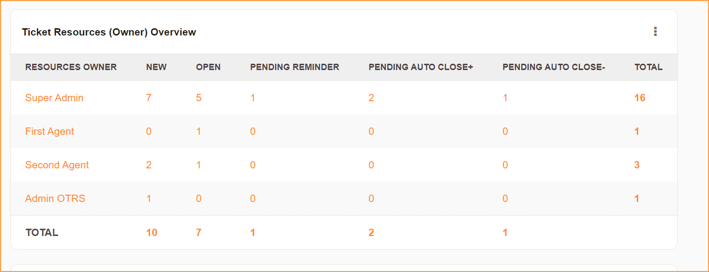

# Znuny-Ticket-Resources-Overview-Dashboard
- For Znuny 6.5.x and 7.0.x (Build based on Znuny 7.0.9)  
- For older version of Znuny LTS / OTRS 6 (CE), you may try to apply this manually. Not tested but should work.
- Dashboard to Display Resources (Ticket Owner) Per Ticket States

